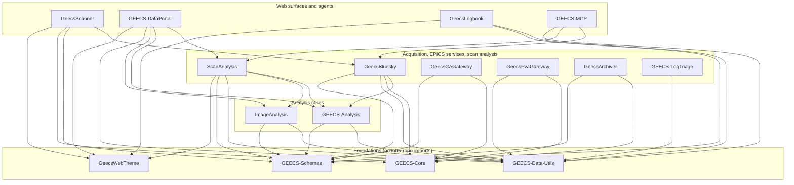

# GEECS-Plugins

The software around GEECS (the Generalized Equipment and Experiment Control
System) used on the BELLA Center laser-plasma accelerator beamlines at
Lawrence Berkeley National Laboratory. GEECS itself is a LabVIEW device
layer; this repository adds what sits around it: an EPICS access layer that
serves GEECS devices as process variables (PVs), scan acquisition built on
[Bluesky](https://blueskyproject.io/), tools for navigating and loading scan
data, per-image and per-scan analysis, and the web pages operators use to run
scans and browse results. It is developed and run by the BELLA Center
beamline teams. It is a monorepo of independent Python packages, each with
its own `pyproject.toml`, managed by [Poetry](https://python-poetry.org/).

## Packages

| Package | Purpose | Entry point / port |
|---|---|---|
| `GEECS-Core/` | GEECS access library: UDP/TCP wire protocol, experiment DB, PV naming, the error tree, a synchronous device client, a fake server for tests | library |
| `GEECS-Data-Utils/` | Scan folder navigation, scalar loading, binning, the scan catalog | library; `geecs-himg` |
| `GEECS-Schemas/` | Pydantic schemas for every scanner and analysis config document | library |
| `GeecsWebTheme/` | Shared stylesheets and FastAPI glue for every web surface | library |
| `GEECS-Analysis/` | Pure analysis core: coordinate-aware processing steps driven by recipe documents | library |
| `ImageAnalysis/` | Per-image analyzers and processing pipelines | library |
| `ScanAnalysis/` | Post-scan analysis: task queue, config system, scan analyzers, the web config editor | library |
| `GeecsBluesky/` | Bluesky backend: GEECS devices as ophyd-async devices, the scan plans, the queueserver worker, the Tiled writer, the queue client | queueserver worker (`qserver/launch_re_manager.sh`); `geecs-tiled-writer` |
| `GeecsCAGateway/` | Channel Access gateway serving GEECS devices as PVs (readback + setpoint) | `geecs-ca-gateway` |
| `GeecsPvaGateway/` | pvAccess server on each camera host, serving images and array variables as NTNDArray PVs | `geecs-pva-gateway` |
| `GeecsArchiver/` | Deploy recipe for the EPICS Archiver Appliance and the tool that derives its archive set from the GEECS DB | `geecs-archiver` |
| `GEECS-LogTriage/` | Scan-log error triage into a structured report | `geecs-log-triage` |
| `GeecsScanner/` | Web scanner console: submit, watch and stop scans | `geecs-scanner`, port 8300 |
| `GEECS-DataPortal/` | Web scan browser: day, scan, metadata, plots, images; on-request analysis | `geecs-data-portal`, port 8200 |
| `GeecsLogbook/` | Web logbook: a scans book over scan folders and an ops book | `geecs-logbook`, port 8400 |
| `GEECS-MCP/` | Experimental MCP server for AI agents: scan status and results, stop/pause, and a few gated actions (resume, clear queue, run analysis) | `python -m geecs_mcp`, port 8100 |
| `LogMaker4GoogleDocs/` | Legacy Google Docs experiment-log uploader, being replaced by `GeecsLogbook/` | library |

Each package has its own `README.md` and `CHANGELOG.md` and is versioned
independently.

### Dependencies

Arrows mean "imports" (some edges are optional extras, e.g. the portal's
analysis features or ScanAnalysis's config editor). Edges only point down the layers, and packages in one
layer never import each other; this is enforced on every commit by
[import-linter](https://import-linter.readthedocs.io/) (`.importlinter`).



`LogMaker4GoogleDocs` stands alone. Nothing imports the gateways: they are
consumed as services, over the network, as PVs.

## How the pieces fit at run time

- **GEECS devices** (LabVIEW) are described by the **experiment DB** and spoken
  to over UDP/TCP through `GEECS-Core`.
- The **CA gateway** serves every device's scalar variables as EPICS PVs; a
  **PVA gateway** on each camera host serves images and arrays. Stock EPICS
  clients (Phoebus, the Archiver Appliance, ophyd-async) read and write them.
- The **queueserver worker** (`GeecsBluesky`) runs Bluesky plans against those
  PVs. Each scan gets a numbered folder in a date-structured tree on the data
  share: the worker writes the scalar tables and scan metadata there, the
  devices save their own per-shot files (images, traces) into it, and the
  **Tiled writer** registers each run in a [Tiled](https://blueskyproject.io/tiled/) catalog.
- The **scanner** submits scans to the worker; the **data portal** browses the
  scan folders and runs analysis on request; the **logbook** shows each day's
  scans beside operator notes.
- The end-to-end picture, including the scan folder layout, is in the
  [data-flow map](https://geecs-plugins.readthedocs.io/en/latest/sites/data_flow/) and the [tutorials](docs/tutorials/).

## Getting started

Python 3.11 and Poetry are required.

```bash
poetry install                        # at the root: the analysis packages, Bluesky, docs and lint tools
cd GeecsCAGateway && poetry install   # services and web surfaces install in their own directory
poetry run pre-commit install         # once: ruff, pydocstyle, import contracts on every commit
```

The pre-commit hooks auto-fix files and abort a plain `git commit` when they
do; `scripts/commit.sh -m "..."` applies the fixes, re-stages and commits.

Code that touches the data share, the experiment DB or the gateways reads a
client config at `~/.config/geecs_python_api/config.ini`; the keys and the
service-host counterpart (`/etc/geecs/site.env`) are described in
[docs/platform/site_profile.md](docs/platform/site_profile.md).

```bash
./scripts/check.sh      # lint + tests for what changed, picking each package's env as CI does
poetry run mkdocs serve # the documentation site, locally (root env)
```

- [Getting started tutorial](docs/tutorials/getting_started.md) — the step-by-step version of this section.
- [CONTRIBUTING.md](CONTRIBUTING.md) — branching, versioning, and the PR process.
- [CLAUDE.md](CLAUDE.md) — instructions for AI agents working here (each
  package has its own).

## Where things live

- **Documentation:** <https://geecs-plugins.readthedocs.io/en/latest/>, built
  from [docs/](docs/).
- **Deployment:** [docs/platform/fleet_map.md](docs/platform/fleet_map.md)
  lists every service and where its recipe lives; [deploy/](deploy/) holds the
  shared host bootstrap, and each service keeps its recipe in its package
  (`<Package>/deploy/`; the worker's is `GeecsBluesky/qserver/deploy/`).
- **Not packages:** `scripts/` (check, commit and audit tools), `tests/`
  (repo-wide contract tests), `Planning/` (design notes), `image_analysis_configs/`.
  `extras/` is unmaintained legacy material; do not build on it.
- **Issues:** [GitHub issues](https://github.com/GEECS-BELLA/GEECS-Plugins/issues).

## License

*** Copyright Notice ***

“GEECS (Generalized Equipment and Experiment Control System)”, Copyright (c) 2016, The Regents of the University of California, through Lawrence Berkeley National Laboratory (subject to receipt of any required approvals from the U.S. Dept. of Energy).  All rights reserved.

If you have questions about your rights to use or distribute this software, please contact Berkeley Lab's Innovation & Partnerships Office at  IPO@lbl.gov.

NOTICE.  This Software was developed under funding from the U.S. Department of Energy and the U.S. Government consequently retains certain rights. As such, the U.S. Government has been granted for itself and others acting on its behalf a paid-up, nonexclusive, irrevocable, worldwide license in the Software to reproduce, distribute copies to the public, prepare derivative works, and perform publicly and display publicly, and to permit other to do so.

See [LICENSE.txt](LICENSE.txt).
