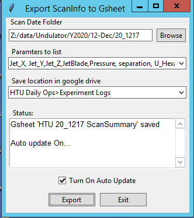
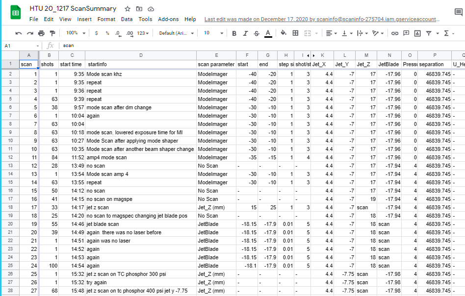

# ScanInfoToGsheetGUI

Last updated on Jun 8th, 2021

This GUI extract scan information and variables of all scans of a day from sfiles and analysis files, then creates a scan summary on a google sheet (automatically saved in a google drive). There is an option to autoatically update it every minute so you can let it run during the experiment.

## How to run

* Clone the folder to your local computer. There is also an executable at [release page](https://github.com/GEECS-BELLA/GEECS-Plugins/releases), but most likely it is not up to date.

* Download a [json file](https://drive.google.com/file/d/1q3kZ9eK_sg6X9vrSyA4xOed_7NVv9z0U/view?usp=sharing)(Only accessible to LBNL BELLA group) and put it in the same location as the where the files are located. This is an access key to to BELLA google drive.

* Run ScanInfoToGsheetGUI.py. The GUI will pop up.

* GUI: 
    1. In 'Scan Date Folder' section, choose a folder of a scan date where scan data is stored. Ex) 'Z:\\data\\Undulator\\Y2020\\01-Jan\\20_0123'. 
    2. Choose a list of parameters you want to be listed in the google sheet. You can add/edit the list by editing the [config_parameters.ini](config_parameters.ini).
    3. Choose a google folder location for the gsheet to be saved. To add/edit the list by editing the [config_gdrive.ini](config_gdrive.ini). Here, scaninfo@scaninfo-275704.iam.gserviceaccount.com needs permission to the google folder, so make sure you allow permission to it.
    4. You can select/unselect 'enable auto update' anytime to run/stop the auto update. It will update the Google sheet every minute as long as you already clicked Export before.
    5. Click **Export**.

## If you want to set gsheet title and saving location manually...
Run function/gsheet.py (It does the same thing as ScanInfoToGsheetGUI, but without the GUI).

Before running, open the file and fill in sections in main function.

* dir_date: Date folder where scan data is stored.
    ex) `dir_date = 'Z:\\data\\Undulator\\Y2020\\01-Jan\\20_0123'`
    
* sheet_title: title of the Google sheet you want to create (str)

* para_txt: experimental parameters to be shown in the Google sheet. Can be just part of the full parameter name (show the value of first shot of each scan) 
    ex) `para_txt = 'Jet_X,Jet_Y,Jet_Z,Pressure,separation'`
    
* gdrive_dir: folder ID of a Google drive where the Google sheet is saved. ID can be found in the last part of the URL.(str)

* isAutoUpdate: If you want to keep running the code to automatically update the Google sheet during the run (every minute), set `isAutoUpdate=True`

Run this python script in the command line `python ExportScanInfo.py`. Or, you can run right click the file in the folder, 'Open with > Python'.

Fumika Isono (fisono@lbl.gov, fumika21@gmail.com)
