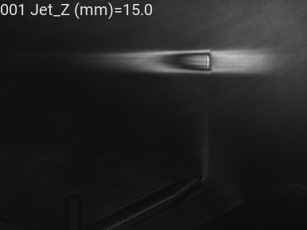

# READ ME

## Analyze experimental data
You can analyze data with jupyter notebook very easily. Templates are included in this folder (Check out dataanalysis-notebook/200817_OAP2_ebeampointing.ipynb).

## Converting images to GIF
Check out Gonvert2GIF.ipynb. You can convert images in a folder to one GIF. It will include a text with shotnumber and scan variable&parameter! The GIF will be saved in the folder where images are stored.
- significant bits are taken care. make labview=True for images saved by labview devices.
- Can change the contrast ratio by specifying gamma value (gamma= ), or taking a log of counts (log=True)
- Can change frame per second (fps=)

