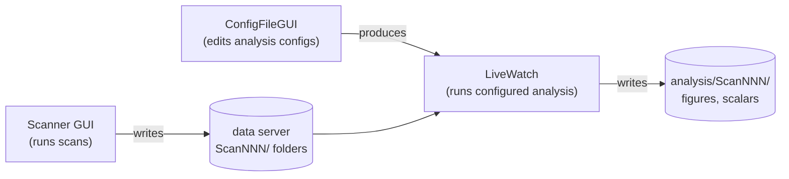

# Apps

The GEECS Plugin Suite ships three GUI applications that cover the two
halves of the experimental data lifecycle. They're the canonical entry
points for most day-to-day use — everything they do is also available
through the Python API, but the apps are usually the friendlier path.

If you've never used the suite before, the end-to-end **[Tutorial](tutorial.md)**
is the right place to start. It walks through configuring an analysis
pipeline in ConfigFileGUI, adding it to a group, and running that group
on a real scan via LiveWatch.

## The three apps

**[Scanner GUI](../geecs_scanner/overview.md)** runs scans on the beamline.
It manages save elements (which devices to record), drives multi-scan
batches, and supports Xopt-driven optimization. Documented in its own tab
because the data-acquisition workflow is substantially different from the
analysis one.

**ConfigFileGUI** is a point-and-click editor for the YAML files that drive
Image Analysis and Scan Analysis. It loads a `scan_analysis_configs/`
directory and renders typed editors for the per-diagnostic analyzer configs
(camera or 1D) and the group configs that bundle them.

**LiveWatch** watches a data directory for new scans and dispatches a
configured analyzer group as each scan completes. It's the canonical way to
run analysis alongside live data taking — configure once at the start of a
shift, hit Start, and every subsequent scan produces summary figures (and
optionally Google Doc e-log uploads) without anyone touching a notebook.

## How they fit together

Scanner GUI writes raw scan folders to the data server. ConfigFileGUI
authors the YAMLs that describe how each diagnostic should be analysed and
which diagnostics belong in which group. LiveWatch combines the two — it
watches for new scan folders and runs the configured analyzer group against
each one as scans complete.

All three are PyQt5 apps. They share the same Pydantic schemas and
filesystem conventions. None of them holds any state of its own: everything
is driven by YAML configs and the data on disk, so two collaborators
running the same configs against the same data get the same results.

## See also

- **[Tutorial — end-to-end](tutorial.md)** — start here if you're new.
- [Image Analysis overview](../image_analysis/overview.md) — the per-shot
  processing pipeline that ConfigFileGUI is configuring.
- [Scan Analysis overview](../scan_analysis/overview.md) — the per-scan
  orchestration layer that LiveWatch is running.
