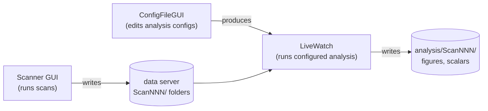

# Apps

The GEECS Plugin Suite ships three GUI applications that cover the two
halves of the experimental data lifecycle. They are the canonical entry
points for most day-to-day use; everything they do is also available as a
Python API, but the apps are usually the friendlier path.

-   :material-monitor-eye:{ .lg .middle } **Scanner GUI**

    ---

    Runs scans on the beamline. Configures save elements, drives multi-scan
    batches, runs Xopt-driven optimization. The data-acquisition surface
    of the suite.

    [:octicons-arrow-right-24: Scanner GUI tab](../geecs_scanner/overview.md)

-   :material-file-cog-outline:{ .lg .middle } **ConfigFileGUI**

    ---

    Point-and-click editor for the YAML files that drive Image Analysis and
    Scan Analysis. Builds per-camera / per-1D analyzer configs and the
    groups that LiveWatch dispatches.

    [:octicons-arrow-right-24: ConfigFileGUI](config_file_gui.md)

-   :material-play-circle-outline:{ .lg .middle } **LiveWatch**

    ---

    Automated per-scan analysis runner. Watches a data directory and
    dispatches a configured analyzer group as each scan completes.
    Supports e-log upload via the Google Doc integration.

    [:octicons-arrow-right-24: LiveWatch](live_watch.md)

-   :material-school-outline:{ .lg .middle } **Tutorial — end-to-end**

    ---

    Walk through the full workflow: build a per-camera analyzer config in
    ConfigFileGUI, reference it from a group, run that group on a real
    scan with LiveWatch.

    [:octicons-arrow-right-24: Tutorial](tutorial.md)

## How they fit together

The three apps sit at different points in the same workflow:

- **Scanner GUI** writes raw scan folders to the data server.
- **ConfigFileGUI** authors the YAMLs that describe how each diagnostic
  should be analysed and which diagnostics belong in which group.
- **LiveWatch** combines the two: it watches the data server for new
  scan folders and runs the configured analyzer group against each one as
  scans complete.

All three are PyQt5 apps; they share the same Pydantic schemas and
filesystem conventions. None of them has any state of its own — everything
is driven by the YAML configs and the data on disk, so two collaborators
running the same configs against the same data get the same results.

## See also

- The [end-to-end tutorial](tutorial.md) is the right starting point if
  you've never used the suite before.
- [Image Analysis overview](../image_analysis/overview.md) explains the
  per-shot processing pipeline that ConfigFileGUI is configuring.
- [Scan Analysis overview](../scan_analysis/overview.md) explains the
  per-scan orchestration layer that LiveWatch is running.
