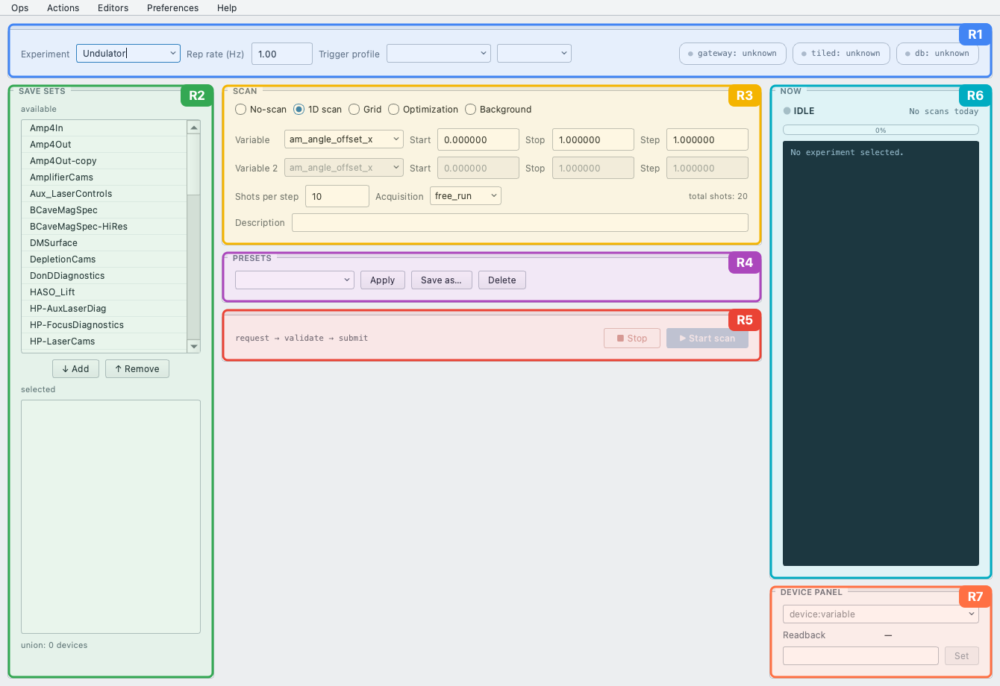

# GEECS Console

The GEECS Console is the operator application for running scans on a GEECS
beamline: pick what to record, drive the scan, and watch it happen. It is
the successor to the legacy Scanner GUI, built on a modern acquisition
stack — scans execute through [Bluesky](https://blueskyproject.io/), devices
are reached through the GEECS Channel-Access gateway, and every scan is
archived both as a classic GEECS scan folder *and* as a structured run in a
[Tiled](https://blueskyproject.io/tiled/) catalog.

Two windows ship in the package:

- **The console** — scan submission and live monitoring (this page and
  [Running Scans](running_scans.md)).
- **The scan browser** — a quick-look client for recorded scans
  (day → scan → plot/table/drift); see [Scan Browser](scan_browser.md).
  It works standalone, so analysts can use it without ever running the
  console.

## Install & launch

From a checkout of GEECS-Plugins:

```bash
cd GEECS-Console
poetry install
poetry run python main.py            # the operator console
poetry run geecs-scan-browser        # the scan browser
```

Requirements: Python 3.11, Poetry, and the shared GEECS user config at
`~/.config/geecs_python_api/config.ini` (data paths, `[tiled]` server,
database credentials location). The console is **offline-first**: it opens
and runs with zero network — health chips simply report what is
unreachable — so you can explore the interface anywhere.

## A tour of the window

The main window is organised into seven regions (**R1–R7** below — the
same region names used throughout the code and its documentation):



- **R1 — Session bar** — the experiment selector, rep rate, and trigger
  profile (which timing configuration drives the shots), plus three
  **health chips**: gateway, Tiled, and database. Green means live; a
  down chip tells you which piece of infrastructure to check before
  blaming a scan.
- **R2 — Save sets** — pick one or more named *save sets* (groups of
  devices and variables to record). The union line shows how many devices
  the current selection resolves to. See [Save Sets](save_sets.md).
- **R3 — Scan form** — the scan itself: mode (No-scan / 1D / Grid /
  Optimization / Background), the scan variable and its start/stop/step,
  shots per step, the acquisition style (`free_run` or `strict` — see
  [Running Scans](running_scans.md)), and a description that ends up in
  the scan's metadata.
- **R4 — Presets** — a preset *is* a saved scan request: the entire form,
  reloadable in one click, stored as YAML in the experiment's configs
  repository.
- **R5 — Start / Stop** — Start validates everything up front (unknown
  names and bad configs are refused before any hardware is touched); Stop
  aborts cleanly, restoring the trigger to its standby state.
- **R6 — Now panel** — live state pill, progress bar, and the "Scan NNN"
  label with a compact log tail. Optional per-shot beeps live under
  Preferences.
- **R7 — Device panel** — a one-off device readback/set control: pick any
  `Device:Variable`, watch it live, set it. Useful for small manual
  adjustments without leaving the console.

!!! note
    The screenshot is generated headlessly from the real application
    (`GEECS-Console/scripts/generate_screen_map.py` draws the region
    highlights from the live widget geometry) — re-run it whenever the
    window changes and the figure stays accurate. For what each *control*
    does, hover it in the app: operator tooltips are built in
    (Preferences → Show tooltips).

The menu bar carries **Ops** (open config folders, today's scan folder,
GitHub), **Editors** (the four config editors: save sets, scan variables,
trigger profiles, action library — all editing the same YAML files the
scans consume), and **Preferences**.

## What happens when you press Start

The form becomes a `ScanRequest` — a validated, versioned document (the
`geecs-schemas` package) that fully describes the scan. The engine
resolves every named config *before* touching hardware (fail-fast: typos
surface in the status bar, not mid-scan), connects the devices, claims the
next scan number, and executes. Everything you selected is recorded, plus
**background telemetry**: every other live experiment device's logging
variables ride along as extra columns for free (see
[Scan Data](scan_data.md)).

Because the submission object is a plain document, everything the console
does is also scriptable — the same request can be submitted from Python
(`GeecsSession.run`) with identical results. The console is a front-end,
not a gatekeeper.

## Where to go next

- [Running Scans](running_scans.md) — modes, acquisition styles, presets.
- [Save Sets](save_sets.md) — deciding what gets recorded.
- [Scan Data](scan_data.md) — what a finished scan looks like on disk and
  in Tiled, and how to interpret the columns.
- [Troubleshooting](troubleshooting.md) — health chips, common failure
  modes, and the log-triage tools.
