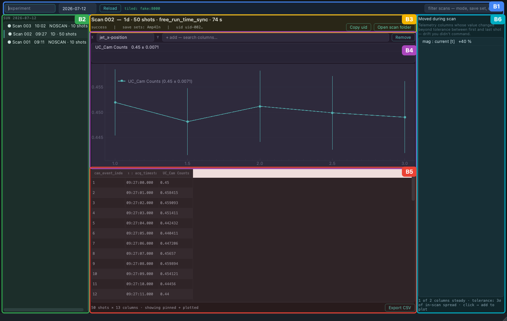

# Scan Browser

The scan browser is the quick-look client for recorded scans: pick a day,
pick a scan, see what happened — without writing a line of analysis code.
It reads the Tiled catalog directly and is fully independent of the
operator console (analysts can install and run just this).

```bash
cd GEECS-Console
poetry run geecs-scan-browser        # or: python -m geecs_console.browser
```

## What it shows

The window is organised into six regions (**B1–B6**; shown here with
synthetic demo data):



- **B1 — Controls bar** — experiment, date, Reload, the Tiled connection
  chip, and a type-to-filter box for the run list.
- **B2 — Run list** — the scans recorded on the chosen day (newest
  first), with mode and shot counts.
- **B3 — Run header** — the selected scan's identity: mode, shots,
  acquisition style, duration, exit status, save sets, plus *Copy uid*
  and *Open scan folder* (strictly read-only — the browser never creates
  or modifies anything on the data share).
- **B4 — Plot** — any recorded column vs shot or vs the scan variable;
  1D scans are binned per step with error bars (as in the figure).
- **B5 — Table** — the raw per-shot event rows, pinned + plotted columns
  first, with CSV export.
- **B6 — Drift** — the telemetry drift report: which background-telemetry
  channels *moved* during the scan (|last − first| beyond 3σ of the
  in-scan spread), sorted by significance. The fastest way to answer
  "did anything else change while I was scanning?"

!!! note
    The screenshot is generated headlessly from the real application over
    a synthetic catalog
    (`GEECS-Console/scripts/generate_browser_screen_map.py`) — the region
    highlights are drawn from live widget geometry, so re-running the
    script keeps the figure accurate as the UI evolves.

## Notes

- Every catalog call runs off the GUI thread — a slow network (VPN) makes
  the browser *wait*, never freeze; superseded requests are dropped.
- Offline it opens with an empty catalog and says so; nothing breaks.
- Aborted or legacy runs without event rows display metadata only.
- The column semantics behind the plot/table/drift views are the shared
  `geecs_data_utils.tiled_schema` module — the browser interprets no
  column names on its own, so it stays automatically consistent with the
  data contract in [Scan Data](scan_data.md).
