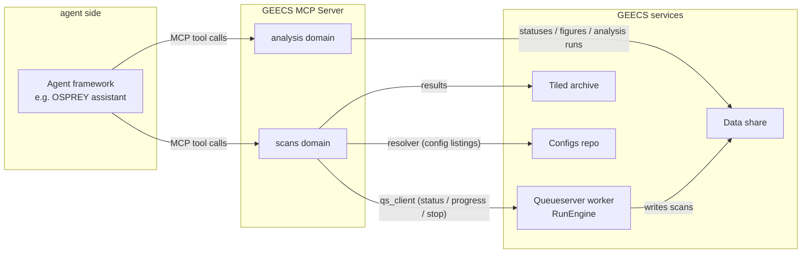

# GEECS MCP Server — overview

**GEECS-MCP** is the general GEECS server for AI agents: one deployed
service that exposes the lab's GEECS-semantic operations — the scan
service, the config catalogs, archived results, post-scan analysis — as
typed tools an agent can call. It is what turns "ask the assistant how
scan 12 is going and what it measured" from a demo into a governed,
auditable interaction with the machine. Starting a scan is deliberately
not part of that surface — see [No write path here](#where-it-sits-in-the-architecture).

This page is a concepts-first orientation. The authoritative detail lives
in the package alongside the code: `GEECS-MCP/CLAUDE.md` (architecture and
boundaries), `GEECS-MCP/deploy/DEPLOYMENT.md` (the one full inventory of
configuration keys, transports, and the permission-gating semantics).
Treat those as the source of truth if anything here disagrees.

## What "MCP" is

The [Model Context Protocol](https://modelcontextprotocol.io) (MCP) is an
open standard for connecting AI agents to external systems. A server
declares a set of **tools** — named, typed, callable functions with
documented parameters — and an agent connected to that server can invoke
them during a conversation. The agent decides *when* to call a tool from
the conversation's needs; the server decides *what each call is allowed to
do* and returns a structured result.

That split is the whole point. The language model brings flexible intent
("rerun yesterday's failed analyses"); the server brings a fixed,
reviewable surface (a `run_scan_analysis` tool with exactly these
parameters, exactly these refusal conditions). Nothing the agent says can
make the server do something outside its tool surface.

## Why GEECS needs its own server

BELLA is already EPICS-fronted through the
[GEECS Gateway](../geecs_gateway/client_overview.md), so an agent framework
with generic EPICS tools can read any process variable without this server
existing. But raw PV access cannot express the operations that actually
matter:

- "Is a scan running, how far along is it, and whose is it?" — that is
  the **queueserver's** manager state and document stream, not a PV
  read.
- "What did scan 12 measure?" — that is a **Tiled archive** lookup with
  the run's metadata and per-column statistics.
- "Which presets and trigger profiles exist for this experiment?" —
  that is the **configs repository**, resolved and validated the same way
  the web scanner does it.
- "Run the standard analysis on this scan" — that is the **ScanAnalysis
  pipeline** with its task queue and figure outputs.

The MCP server exposes exactly these GEECS-semantic surfaces. It
deliberately does **not** duplicate raw-PV channel tools — the agent
framework's own EPICS tools cover channel-level access, including
bounded setpoint writes (see the
[division of labour](osprey.md#the-division-of-labour)).

## Where it sits in the architecture

The server is a **read-and-halt client of the queueserver** — and never
an engine. It reads status, history and progress, and can halt a run,
through the same client seam the web scanner uses
(`geecs_bluesky.qs_client`); since 0.9.0 it has no submit verb,
resolves configs through the same resolver, and reads results from the
same Tiled catalog. Scan execution stays entirely in the GEECS engine (the
queueserver worker); the MCP never drives devices shot-by-shot.

Two standing doctrines shape everything above:

- **No write path here.** This server had submit / action / manual-move
  verbs; 0.9.0 removed them when the native-Bluesky rebuild retired the
  client calls behind them, and they were deleted rather than rewired
  because the server is an experiment rather than an operator surface.
  Scans are submitted from the **web scanner**. The doctrine for
  whenever an agent-facing write path returns (#727): GEECS-*semantic*
  writes go through named, gated MCP verbs with their own refusal logic,
  and scans stay in the GEECS engine. Channel-level setpoint writes are
  deliberately *not* MCP territory: the agent framework's own EPICS write tool can set gateway
  `:SP` PVs directly, bounded by its limits database and gating — but
  that raw path bypasses the GEECS client-side hardening (put-failure
  visibility, confirm/pseudo semantics, mid-scan refusals), which is
  exactly why operations with GEECS semantics belong behind an MCP verb.
- **A client, never an engine.** The server imports only the shared
  public seams, never engine internals. If a tool needs something
  private, the right move is to promote a small public module in
  GeecsBluesky — the server's needs surface real seams rather than
  growing a second engine.

## Domains

Tools are organised into **domains** — subpackages added as they earn
their keep, never speculatively:

| Domain | Status | What it covers |
|---|---|---|
| [Scan service](scan_service.md) | Built (read + halt) | Status, history, results, config listings, progress; stop/pause/resume and clear_queue. **No submit verb** since 0.9.0 |
| [Analysis](analysis.md) | Built (read + execution) | Task statuses and output trees, figures, on-demand ScanAnalysis execution |
| Health / DB / Logs | Candidates | Gateway and archive probes, device-variable metadata, log triage as a tool |

Capabilities that require Windows-only acquisition SDKs (some analysis
diagnostics) do not force this server onto Windows — the pattern is a
small *satellite* MCP server on a Windows box, registered as a second
server entry with the same conventions.

## The safety model

Every tool belongs to one of three classes, and the class determines how
it is gated (`geecs_mcp/tool_names.py` is the one place the names and
class groupings are spelled; anything listing tool names elsewhere is
kept in step with it):

- **R — read-only.** Status, listings, results, figures, progress. Safe
  to auto-allow; calling them changes nothing.
- **Q — queueing.** Anything that starts work or changes state:
  `clear_queue`, `resume_scan`, `run_scan_analysis`. (The submit-side
  verbs — `submit_scan`, `run_action`, `move_scan_variable` — were
  removed in 0.9.0; see [the scan service](scan_service.md).)
  Interactively these surface a
  native *ask* prompt (a human sees each call with its arguments before
  it runs); headless/unattended operation gates them through the agent
  framework's explicit `write_tools` list (a tool listed there is
  gated when no human is watching; the gating semantics live in
  `deploy/DEPLOYMENT.md`).
- **S — stop direction.** `stop_scan` and `pause_scan`. These are asked
  about interactively but **deliberately never listed in `write_tools`**
  — a halt must never be blocked on any path. Making the machine quieter
  is always allowed.

On top of the classes sit per-verb protections: stop, pause and resume
carry **ownership etiquette** — a scan this deployment did not submit is
foreign, and halting it needs `force=true`, which is approval-gated. The
comparison is against a configured client identity, so a halt is never
aimed at another client's run by accident.

## Conventions every tool follows

- **Tools never raise.** Every result is a JSON envelope: `ok: true`
  plus the payload, or `ok: false` with an `error_kind` from a fixed
  taxonomy (`invalid_request`, `not_found`, `policy_refusal`,
  `manager_unreachable`, …) and a message that preserves the engine's
  own wording — those strings are the operator vocabulary.
- **Payloads are context-sized.** Results return metadata, column names,
  and capped statistics — never full event tables; figures return
  *references* (path + fetch URL) rather than image bytes, with a
  bounded thumbnail as an explicit opt-in. Anything truncated says so.
- **No tool blocks on completion.** Long work is request-and-poll: a
  tool that starts work returns as soon as it is enqueued, and a read
  tool polls progress. A stuck tool call cannot wedge an agent
  conversation.
- **Everything degrades honestly.** The server always starts; an
  unconfigured or unreachable dependency turns the affected tools into
  clear refusals that name what is missing, never crashes.

## Configuration and deployment

Configuration is only the standard
`~/.config/geecs_python_api/config.ini` — the same fleet-wide file every
GEECS Python tool reads; the server introduces no new config format.
`GEECS-MCP/deploy/DEPLOYMENT.md` is the one full key inventory and the
deployment runbook. Two transports exist: **stdio** (the dev loop — the
agent framework launches the server as a subprocess) and **central HTTP**
(the multi-machine mode — one server process on the lab server, reachable
from any machine on the network).
