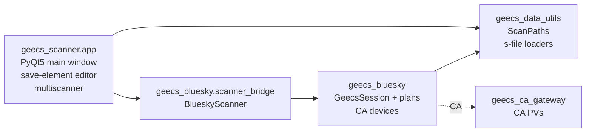

# Architecture

This page is for people reading or modifying the scanner code, not for users running scans. If you're trying to acquire data, the [Tutorial](tutorial.md) is the right starting point. If you want to extend the scanner with a custom evaluator or analyzer, see [Extending the Scanner](extending.md).

What follows is the mental model: how a scan flows from the GUI button into the engine, what events fire when, and the boundaries that exist. Since the legacy in-package engine was deleted, **scan execution lives in GeecsBluesky** — this package is the PyQt5 front-end plus the GUI→engine contract. The engine's own architecture (acquisition modes, plans, device layer, shot control) is documented in `GeecsBluesky/CLAUDE.md` and the [scan events API page](api/scan_events.md).

## Package layout

The `app/` package is the PyQt5 layer: widgets, dialogs, a status display. It talks to the engine through one object — the `RunControl` adapter, which submits the scan to `BlueskyScanner` — and listens to one signal: `ScanEvent` instances delivered through a Qt-bridged callback. Everything below `BlueskyScanner` is GeecsBluesky's business: the `RunEngine` scan thread, acquisition-mode dispatch, shot control, native device saving, and Tiled persistence.

What remains of `geecs_scanner.engine` after the deletion:

- `engine/models/` — the typed GUI→engine contract (`ScanExecutionConfig`, `ScanOptions`, `SaveDeviceConfig`, action step types)
- `engine/scan_events.py` / `engine/dialog_request.py` — re-export shims of `geecs_bluesky.events`, so existing imports keep working
- `ActionManager` + `DeviceCommandExecutor` — the GUI-side action library execution path (used outside scans, e.g. the action library editor's Execute button)
- `database_dict_lookup.py` — experiment device enumeration for the editors

## What happens when you press Start Scan

1. The window collects the UI state and builds a `ScanExecutionConfig` (or, on the schema path, a `ScanRequest`).
2. `RunControl.submit_run(...)` hands it to `BlueskyScanner.reinitialize(...)` — validation happens here, fail-fast, before any hardware is touched.
3. `BlueskyScanner.start_scan_thread()` launches the scan in a background thread; the Bluesky `RunEngine` executes the plan.
4. The engine emits `ScanLifecycleEvent`s (INITIALIZING → RUNNING → DONE/ABORTED), per-shot `ScanStepEvent`s, and pre-flight `ScanDialogEvent`s through the `on_event` callback. The window receives them on the Qt main thread via a `pyqtSignal(object)` bridge. The window does not poll; the engine does not import Qt.

## Event vocabulary

Every event inherits from `ScanEvent` (a frozen dataclass with a timestamp). The hierarchy lives in `geecs_bluesky.events`; `geecs_scanner.engine.scan_events` is a re-export shim. See the [Scan Events API page](api/scan_events.md) for the formal reference.

| Event | When it fires | Key fields |
|---|---|---|
| `ScanLifecycleEvent` | Every state transition | `state`, `scan_number` (once claimed), `total_shots` |
| `ScanStepEvent` | Per event document during acquisition | `step_index`, `total_steps`, `shots_completed`, `phase` |
| `ScanDialogEvent` | Pre-flight needs the operator to choose Abort or Continue | `request` (a `DialogRequest` with a `response_event`) |
| `DeviceCommandEvent` | **Not emitted by the Bluesky backend** (deliberate — no GUI consumer) | — |

A consumer can build the GUI status, a progress bar, a log stream, or a remote monitor from this stream alone. The `ScanDialogEvent` is the one event that requires the consumer to call back: the scan-side blocks on `request.response_event.wait()` until the GUI answers — this is how pre-flight questions get a Qt-main-thread dialog without the scan thread touching Qt.

## Key boundaries and why they exist

**`ScanExecutionConfig` between GUI and engine.** The Pydantic model makes the contract explicit, validates types at the boundary, and gives the engine typed attribute access. If you're adding a new setting that affects scan execution, add it to the model — not a side-channel kwarg. (The schema-world equivalent is `geecs_schemas.ScanRequest`, which `BlueskyScanner.reinitialize` also accepts and delegates to the engine's one runner.)

**Events as the GUI/engine contract.** The window never reaches into scanner internals to check state; it reacts to the events it receives. This is what lets the engine run headless (`GeecsSession`) without losing GUI fidelity.

**`DeviceCommandExecutor` as the GUI-side command policy point.** Outside scans (action library execution), every `device.set`/`device.get` goes through this object: retry policy, escalation to the operator dialog, event emission. In-scan device I/O is the engine's business and rides the gateway `:SP` put primitive instead.

## Threading model

- **Qt main thread.** Owns the window, all widgets, all dialogs. Receives `ScanEvent` via the `pyqtSignal(object)` bridge. Never blocks on hardware.
- **Scan thread.** Created by `BlueskyScanner.start_scan_thread()`; runs the `RunEngine` (whose internal asyncio loop persists across scans). Talks to hardware through the CA gateway. Cannot touch Qt directly.

## Headless capability

The engine runs without the GUI: `geecs_bluesky.session.GeecsSession` is the headless front door (`session.run(ScanRequest)`), and `BlueskyScanner` itself has no Qt imports — pass `on_event=lambda e: print(e)` to see the event stream from a script. The Qt bridge in the GUI is just one consumer; a CLI runner, a remote monitor, or a test harness can be another.

## Things to read next

If you're going to change scan execution, read GeecsBluesky: `events.py` (the public contract), `scanner_bridge/bluesky_scanner.py` (the GUI bridge), `session.py` / `scan_request_runner.py` (the engine front doors), and `EVENT_SCHEMA.md` (the data contract). If you're changing the GUI, `app/run_control.py` is the adapter where the two worlds meet.
