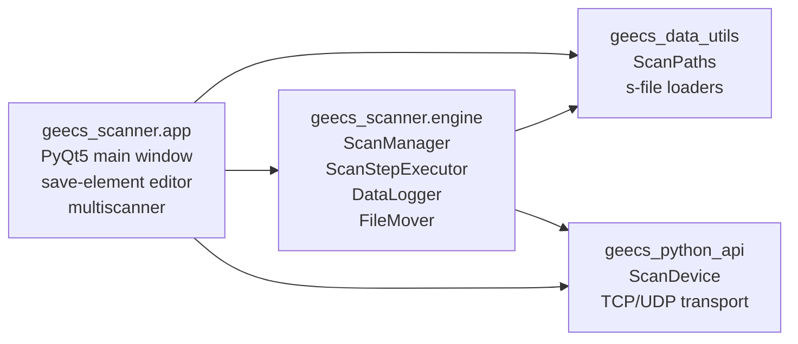
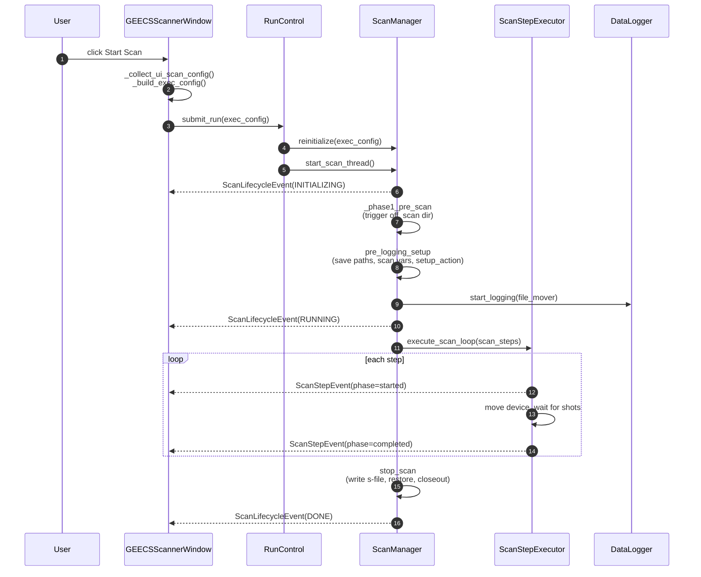
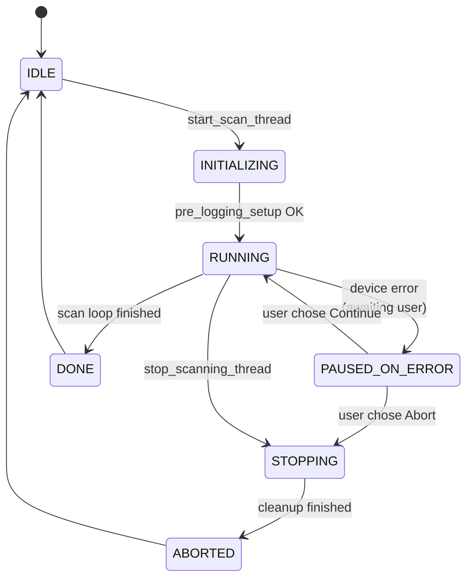

# Architecture

This page is for people reading or modifying the scanner code, not for users running scans. If you're trying to acquire data, the [Tutorial](tutorial.md) is the right starting point. If you want to extend the scanner with a custom evaluator or analyzer, see [Extending the Scanner](extending.md).

What follows is the mental model: how a scan flows from the GUI button through the engine, what events fire when, where each piece of state lives, and the rationale for the boundaries that exist.

## Package layout



The engine is the headless-capable core: `ScanManager` owns the scan thread, `ScanStepExecutor` walks scan steps, `DataLogger` records per-shot data, `FileMover` moves device files into the scan folder. All of these can run without a Qt event loop. The `app/` package is the PyQt5 layer that wraps them with widgets, dialogs, and a status display.

The `app/` package talks to the engine through one object — the `RunControl` adapter — and listens to one signal — `ScanEvent` instances delivered through a Qt-bridged callback. Everything else is internal to the engine.

## What happens when you press Start Scan



Each arrow back to the window is a `ScanEvent` delivered on the Qt main thread via a `pyqtSignal(object)` bridge. The window does not poll. The engine does not import Qt.

## The state machine

`ScanState` lives in `geecs_scanner.engine.scan_events` and is owned by `ScanLifecycleStateMachine` (in `engine/lifecycle.py`). Every transition emits a `ScanLifecycleEvent`.



The GUI maps states to colors: orange = INITIALIZING, red = RUNNING, yellow = PAUSED_ON_ERROR, green = DONE/IDLE/ABORTED. There is no separate "paused" state — pausing during normal acquisition uses a `threading.Event` rather than a state transition, since it does not change what the engine *is*, only what it does next.

## Event vocabulary

Every event inherits from `ScanEvent` (a frozen dataclass with a timestamp). The full hierarchy lives in `engine/scan_events.py`. Consumers receive events through one callback, registered when `ScanManager` is constructed.

| Event | When it fires | Key fields |
|---|---|---|
| `ScanLifecycleEvent` | Every state transition | `state`, `total_shots` (non-zero only on INITIALIZING) |
| `ScanStepEvent` | Start and end of each scan step | `step_index`, `total_steps`, `shots_completed`, `phase` |
| `DeviceCommandEvent` | Every `device.set` / `device.get` outcome | `device`, `variable`, `outcome` (sent / accepted / rejected / failed / timeout) |
| `ScanErrorEvent` | Recoverable or fatal engine error | `message`, `recoverable`, `exc` |
| `ScanRestoreFailedEvent` | Per device that failed to restore after a scan | `device`, `message` |
| `ScanDialogEvent` | Engine needs the operator to choose Abort or Continue | `request` (a `DialogRequest` with a `response_event`) |

A consumer can build the GUI status, a progress bar, a log stream, or a remote monitor from this stream alone — without reaching into engine internals. Tests pin the event sequence (`tests/engine/test_event_emission.py`) so refactors that change internal structure don't accidentally change the public event contract.

The `ScanDialogEvent` is the one event that requires the consumer to call back into the engine: the worker thread blocks on `request.response_event.wait()` until the GUI sets `request.abort[0]` and signals the event. This is how device errors mid-scan get a Qt-main-thread dialog without the worker thread ever touching Qt.

## Where state lives

| State | Lives in | Why there |
|---|---|---|
| Current scan state | `ScanLifecycleStateMachine` | Single ownership; the only way to change it is `set_state()`, which atomically updates and emits |
| Scan execution config | `ScanExecutionConfig` (Pydantic) | Validated at the GUI→engine boundary; the engine never sees raw dicts |
| Scan options | `ScanOptions` (Pydantic) | Same — typed at the boundary |
| Per-shot data | `DataLogger.results` | Sealed by `stop_logging()` before any device interaction that could fail |
| Device file move queue | `FileMover.task_queue` | Decoupled from `DataLogger` so logging cannot block on disk I/O |
| Trigger state (off / scan / standby / singleshot) | `TriggerController` | Single point of control for the shot-control device |
| Device command policy (retry, escalate) | `DeviceCommandExecutor` | Single policy point; injected into every component that calls `device.set` |
| UI flags (is_in_multiscan, is_starting) | `AppController` (in `app/`) | Pure GUI coordination; not part of the engine |

The state-ownership pattern is the most important thing to understand if you're modifying the scanner. Each piece of state has exactly one owner. Everywhere else accesses it through that owner's API. `ScanManager._set_state()` is the only path that changes the lifecycle state. `DeviceCommandExecutor.set()` is the only path that issues a device command during a scan. `ScanLifecycleStateMachine` is the only object that emits `ScanLifecycleEvent`. The rule that catches mistakes early: if you find yourself adding a second path to change something, the first path should absorb your case rather than coexisting with it.

## Key boundaries and why they exist

**`ScanExecutionConfig` between GUI and engine.** Before the typed config existed, the GUI passed raw dictionaries to `ScanManager.reinitialize()` and the engine pulled values out with `.get("key")` calls scattered through several files. The Pydantic model makes the contract explicit, validates types at the boundary, and gives the engine code typed attribute access throughout. If you're adding a new setting that affects scan execution, add it to `ScanExecutionConfig` — not to a side-channel kwarg.

**`DeviceCommandExecutor` as the single command policy point.** Every `device.set` and `device.get` during a scan goes through this object. The retry policy (rejected → retry up to N times; timeout → escalate immediately; failed → escalate immediately) lives in one place. The escalation callback (`request_user_dialog` on `ScanManager`) routes to the operator dialog. If you're adding a new place that talks to hardware mid-scan, route it through `cmd_executor.set()` rather than calling `device.set()` directly — otherwise the retry, escalation, and event emission all silently bypass.

**`FileMover` separated from `DataLogger`.** `DataLogger` builds shot records and queues file-move tasks. `FileMover` runs the worker pool that actually moves files. They were one class for a long time; the separation eliminated a 400-line nested concern and made the orphan-sweep timeout testable without spinning up a real DataLogger.

**`TriggerController` as the shot-control adapter.** All trigger state goes through the controller's typed API (`trigger_off`, `trigger_on`, `set_standby`, `singleshot`) rather than `shot_control.set("variable", "value")` calls. New trigger logic should add a method to the controller, not a new direct call site.

**Events as the GUI/engine contract.** The window subscribes to `ScanEvent` through a `pyqtSignal(object)` bridge that marshals events from the scan thread to the Qt main thread. The window never reaches into `ScanManager` internals to check state; it reacts to the events it receives. This is what lets the engine run headless without losing GUI fidelity.

## Threading model

There are three threads to keep in mind:

- **Qt main thread.** Owns the window, all widgets, all dialogs. Receives `ScanEvent` via the `pyqtSignal(object)` bridge. Never blocks on hardware.
- **Scan thread.** Created by `ScanManager.start_scan_thread()`. Runs `_start_scan()` end to end: pre-scan, acquisition loop, teardown. Owns `pause_scan_event` and `stop_scanning_thread_event`. Talks to hardware. Cannot touch Qt directly.
- **FileMover worker pool.** A pool of threads inside `FileMover` that drain the task queue. Each worker moves files with retry-and-backoff on `OSError`. Independent of the scan thread; its drain is awaited at scan teardown with a hard timeout.

A few cross-thread interactions are worth knowing about. The dialog request mechanism (`request_user_dialog`) lets the scan thread block on a dialog shown from the main thread: it submits a `DialogRequest`, emits a `ScanDialogEvent`, and waits on `request.response_event` until the main-thread handler signals it. The `pyqtSignal(object)` bridge for events is documented in PyQt as thread-safe — events emitted from the scan thread are queued and delivered on the main thread. Both patterns mean you do not need to import Qt anywhere in the engine.

## Why the engine renames happened

In v0.12 the package was renamed `data_acquisition` → `engine`. The motivation was honesty about what the package contained: it was never just data acquisition; it was the entire scan execution layer including the lifecycle state machine, the step executor, and the trigger controller. The rename also made room for the `engine/models/` subpackage that holds the typed configs (`ScanExecutionConfig`, `ScanOptions`, `SaveDeviceConfig`).

If you find documentation or import paths still referencing `data_acquisition`, those are stale. The current path is `geecs_scanner.engine`.

## Headless capability

`ScanManager` has no Qt imports. It can be constructed and run from a script with no event loop:

```python
from geecs_scanner.engine import ScanManager
from geecs_scanner.engine.models.scan_execution_config import ScanExecutionConfig

shot_control = {"device": "U_DG645_ShotControl", "variables": {...}}
sm = ScanManager(experiment_dir="MyExperiment", shot_control_information=shot_control)

sm.reinitialize(exec_config=my_exec_config)
sm.start_scan_thread()
while sm.is_scanning_active():
    time.sleep(0.5)
```

Events are still emitted — pass `on_event=lambda e: print(e)` to `ScanManager(...)` if you want to see them. The Qt bridge in the GUI is just one consumer; a CLI runner, a remote monitor, or a test harness can be another.

## Things to read next

If you're going to change the engine, read these in order: `scan_events.py` (the public contract), `lifecycle.py` (the state machine), `scan_manager.py` (the orchestration shell — focus on `_start_scan`, `_phase1_pre_scan`, `_phase2_acquire`), and `device_command_executor.py` (the command policy). `data_logger.py` and `device_manager.py` are the largest remaining files and have the least test coverage; they work but their internals are still in flux and are likely to change as the Bluesky path matures.
