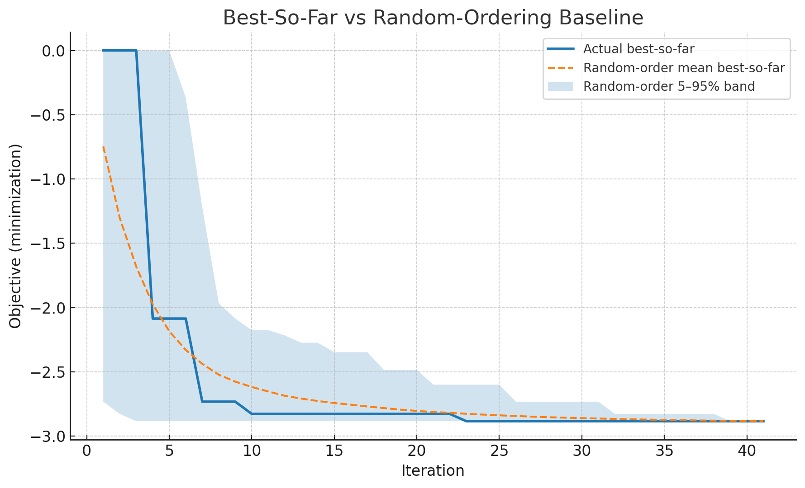
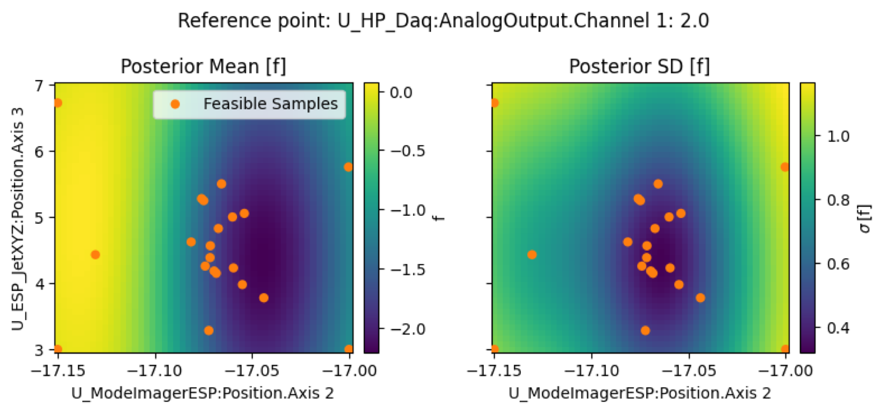
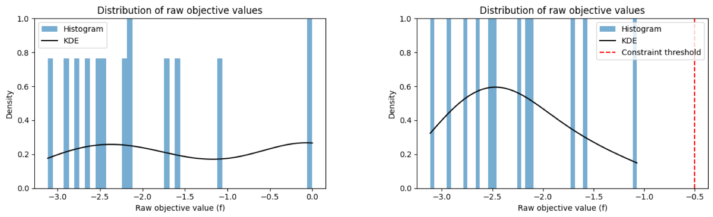
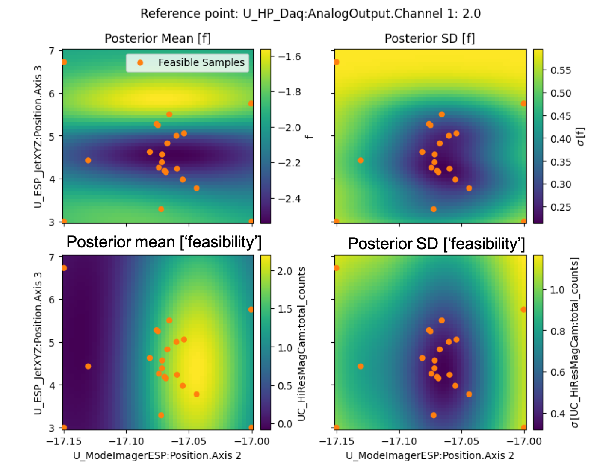

# Optimization Diagnostics & Improvements

Author: Sam Barber

Date: August, 20 2025

We performed a few optimization tests on HTU using the basic 'bayes_default' generator. The objective function is intended to maximize beam brightness (this uses the HiResMagCam evaluator). It does this by fitting a 'bowtie' shape to energy dispersed beam. This provides a proxy for the emittance. The objective function is then the total counts divided by the emittance proxy. Obviously, there are many instances for which the emittance proxy can not be determined. In those cases, the proxy was set to a very large value to indicate 'bad'.

The scans were on August 19th. Scan4 used 3 controls for 20 iterations and Scan6 used 6 controls for 40 iterations.

---

**Baseline: Is the optimizer better than random?**

The optimizer does move things around and generally identifies the 'good beams'. However, it's hard to tell if the optimizer is converging efficiently. In fact, it kind of feels like it moves things around randomly. To understand this we compared the optimizer’s performance against random sampling. Note, we didn't run another optimization with random sampling, but just shuffled the explored configurations randomly and plotted the 'best so far' value. If the optimizer is converging efficiently, we should see it significantly outperform the random sampling.

Plots of **best so far** vs. iteration showed **no advantage over random**, indicating the surrogate wasn’t extracting useful structure from the initial data/representation. This is a little confusing given that the objective function does score the results appropriately. In other words, the values of the objective function compared to the raw data pass the 'eye test'.

{ style="display: block; margin: auto;" width=600px }

The performance of the optimizer compared to random sampling can be quantified with the P value, which was <0.7 for both scans, which indicates it is not better than random.

---

**Potential root causes**

Starting by examining the posterior mean and standard deviation (example of Scan4). This is a 3D scan and for visualization, we picked the optimal value for one of the parameters.

We see the optimizer appears to find a 'basin' region in the posterior mean were the objective function can be minimized. Though, it is fairly broad. We might expect the optimizer to continue to converge in that area (and we do see some clustering of sample points). However, the noise on the posterior mean (on the right) is quite large, almost on the order of the posterior mean itself. The default ExpectedImprovement generator is often going to explore areas of large relative uncertainty, which can be near the edges of the parameter space. So, under the circumstances of this optimization run, the optimizer is likely acting in the expected way. It keeps exploring areas of high uncertainty which keep returning bad beams.

Of course, this is not what we want. Is there a way to improve performance? Why is the uncertainty so large etc.?

Looking at the raw values of the objective function ('f'), something stands out. The experimental settings that lead to 'no beam' or 'really bad beam' all have values in the range of 1e-10 to 1e-5. That's because in these cases the emittance proxy is set to an aribtrary and large value and the objective function is just the total counts divided by this number. This means, we can have a big cluster of data with small objective function values. And this can impact performance.

We inspect and visualize this looking at the Kernel Density Estimate (KDE), shown below. The bars represent a histogram of the raw objective values f. The black line is the KDE — a smooth curve that estimates the distribution of the data.

In the **left plot** we include all points — even ones where the beam wasn't present (i.e., objective values near 0). Because these "no beam" points are clustered and flat, the KDE ends up almost flat too. That flat KDE suggests there's no strong trend or structure in the data — which is misleading.

In the **right plot** we have now enforced a constraint in the model to exclude the 'no beam' values. The data now only includes points from shots where the beam was present. The KDE becomes much more structured: it shows a clear peak, indicating a common range of good values. This makes the underlying distribution of meaningful objective values much clearer. The red dashed line shows a possible constraint threshold — now easier to define in the context of valid data.

**Summary:** The KDE tells us where our data tends to cluster — it’s like a smoothed version of the histogram. When we include lots of "junk" data from failed shots (like no beam), the KDE gets flattened and loses meaning. By removing those points, we see a much clearer picture of how the system performs when it’s actually working — which helps modeling and optimization.

---

**Use constraints to introduce a feasibility model**

We can re-evaluate the posterior distributions after introducing a constraint (easy to implement in Xopt/Geecs-scanner). In this case, there are two models: i) one that represents the underlying shape of the objective function and ii) one that represents the underlying 'feasibility' of obtaining useful data. In this case, we want to maximize 'feasibiliy' and minimize the objective function. A few immediate takeaways. The shape of the posterior is substantially different than the case without the constraints (above). In addition, the range of uncertainty (the posterior SD) is reduced by almost a factor of 3. So, we've already introduced more confidence in the shape of our model. That is, we allow the model to optimized based only on the 'good data' which helps it build a better representation. The 'feasibility' model is used in conjuction to push the optimizer to regions of the parameter space where we expect to get some level of good beam.

---

**Tamping down exploration with TuRBO (trust region)**

Constraints prevent exploring in no‑beam regions, but the EI exploration can still “teleport” within the feasible space. **TuRBO** adds a *local trust region* around the current best value to keep search focused in the current basin, shrinking on consecutive failures and expanding on success. In other words, TuRBO defines a reduced area in parameter space centered on the current best value where the ExpectedImprovement generator is allowed to explore. The size of this area dynamically updates. If the generator fails to improve upon the best value after x number of attempts, the parameter space is reduced around the best value. This allows it to hone on current best values more efficiently if exploration is failing. On the other hand, if the best value is continually improved upon, the parameter space is opened up for more exploration.

For many use cases in experiments at BELLA, it is likely experiments will initialize in some configuration which is already producing a reasonably good result for the target function. For example, before optimizing e-beam performance, it is very likely an operator will have done some preliminary work to find a starting point. In these cases, TuRBO can be a good choice. For truly cold start, this can be a bad choice.

**Next steps**

Introducing both constraints and a TuRBO controller are already feature implemented in Xopt and available through geecs_scanner interface. Constraints should be added to the VOCS entry in the optimizer configs, and the TuRBO controller should be added to a new named generator in the generator_factory.py.
