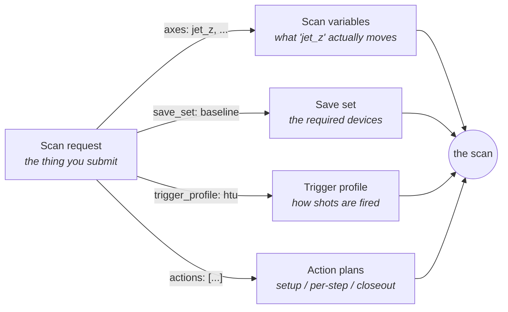

# Scanner Configs, Explained

Everything the scanner does is driven by five kinds of config file. Each one
answers a single question, and a scan is just those answers put together.
This page is the plain-language map; the per-field reference is generated
straight from the code, so it can never drift from what the scanner actually
accepts.

## The five config kinds

**Scan request — "what scan am I running?"**
The one document you actually submit. It says whether you're sweeping a
variable (`step`), standing still collecting shots (`noscan`), or letting an
optimizer drive (`optimize`); which positions to visit and how many shots to
take at each; and — by name — which save set, trigger profile, and action
plans to use. A step scan can sweep one axis or several — several axes form
a grid, with the first axis as the slowest loop and the last as the fastest.
A saved preset *is* a scan request.

**Save set — "which devices does this scan *require*?"**
The devices the scan cannot do without: they get guarantees (complete data,
a dialog if one dies), their images are saved if asked, and their
setup/closeout rituals run around the scan. Each entry records the device's
standard telemetry (what the device database marks for scan logging) by
default, plus any extra scalars you list. You don't declare timestamps or
synchronization flags any more — the scanner works those out. The database's
scan-start/end writes still apply, and an entry can override any of them per
variable: replace the value, or suppress the write entirely with `null`.
Devices *not* in the save set are still logged in the background — see
"Required devices vs background telemetry" below, including the box on
where these database facts live.

**Scan variables — "what am I allowed to sweep?"**
The catalog behind the Variable dropdown. Each entry gives a friendly name
("JetZ (mm)") to a device knob, or defines a *pseudo* variable that moves
several devices together from one number (a jet position that also tracks a
probe stage, for example).

**Trigger profile — "how are shots fired?"**
The machine's trigger states — OFF, STANDBY, SCAN, SINGLESHOT, ARMED — and,
for each one, the exact device writes that put the machine there, in the
order they are sent. A transition can touch several devices (the delay
generator, a gas-jet controller, a shutter), not just one. Alternative
conditions that used to be copy-pasted files — laser on vs laser off — are
now *variants* inside one profile, so the difference is explicit and
reviewable.

**Action plans — "what happens automatically around the scan?"**
Named checklists of steps — set a variable, wait, check a readback, run
another plan. A scan request points at them in three slots: `setup` (before
the scan), `per_step` (between positions), and `closeout` (after, even on
abort).

## Required devices vs background telemetry

"Required" and "recorded" used to be the same decision. They aren't any
more, and the reason is worth two minutes.

**Why the old opt-in existed.** In the legacy scanner, recording a device
meant *depending* on it: the scan subscribed to it, waited on it, and one
dead device out of 117 could stall or kill the whole run. So operators
declared only the devices that truly mattered — sensible self-defence, but
it meant everything else vanished from the record. If nobody thought to add
the vacuum gauges to the save element, the vacuum history of that scan is
simply gone.

**Why background logging is safe now.** The gateway's monitors run
permanently, whether or not a scan is happening. A dead device is no longer
a hang waiting to happen — it's just a set of stale PVs with
`CONNECTED = false`. Reading a cached value costs zero wait. So the scanner
can *softly* record every live experiment device — best-effort snapshot
columns taken from the monitor cache, read-only, never waited on. A device
that's dead at scan start is dropped with a log line. No dialog, no abort,
no slowdown: soft recording cannot hurt a scan, so there is no longer a
reason to throw the data away.

**The one-hand rule: required devices get guarantees; everything else is
logged if alive.** The save set is the *required* list — completeness
checks, dialogs, images, rituals. Background telemetry is everything else
the experiment marks for scan logging (see "Where the database facts come
from" below), kept because keeping it is free.

!!! info "Where the database facts come from"

    The GEECS experiment database is **MySQL**. Per-experiment,
    per-device-variable scan policy lives in one table,
    **`expt_device_variable`** (joined to devices via `expt_device`).
    Four columns drive everything this page calls "database behavior":

    | Column | Meaning |
    |---|---|
    | `get` | `'yes'` = the variable is subscribed/logged for scans — the source of a device's standard telemetry (`db_scalars`) and of background telemetry |
    | `set` | `'yes'` = the scan machinery writes this variable at scan boundaries |
    | `startvalue` | the value written at scan start (what `at_scan_start` overrides) |
    | `endvalue` | the value written at scan end (what `at_scan_end` overrides) |

    The database rows themselves get no schema in this package — device
    facts live below the configs; the configs only *override* them.

Two boundaries follow from the design rather than from preference:

- **Images are only ever required-tier.** File saving needs coordination
  with the device; there is no "soft" version of it.
- **If you need a device synchronous to the shots, it is required — by
  definition.** Softness means never waiting; synchronicity means waiting.
  A device can't be both, so "can this stay background?" has a one-question
  answer: does any analysis need it shot-by-shot?

Background telemetry is on by default for the experiment
(`ExperimentDefaults.background_telemetry`) and can be overridden per scan
(`ScanRequest.background_telemetry`). Converted legacy save elements keep
their exact old recording behavior — they record precisely the variable
lists they always did; the database-first defaults apply to new configs
only.

## How they fit together when a scan runs

When you press Start, the scan request is the only thing submitted. The
scanner looks up the names it contains: the scan variable tells it what to
move, the save set tells it what to record, the trigger profile tells it how
to gate shots, and the action plans run at their slots. Change what a name
*means* (say, add a camera to the save set) and every preset using that name
picks up the change; change the *request* and nothing else is touched.

### What happens when you submit a scan request

Submitting a request kicks off a short, predictable sequence. First a
*resolver* turns every name in the request into the real thing: it opens the
experiment's config folder, finds the save set, trigger profile, scan
variable, and action plans you named, and checks each one — a new-style file
is read directly, an old-style file is converted on the fly (your existing
configs work as-is; nothing needs rewriting first). If a name doesn't exist
or a file doesn't validate, the submission fails right there with a message
naming exactly what's wrong — before any hardware is touched and before a
scan number is used up. Then the engine builds the run from the resolved
pieces: it connects the save set's devices, puts the trigger device under
the profile's control, creates the scan variable's mover, and hands
everything to the scan plan, which sweeps the positions (or just collects
shots, or lets the optimizer steer) and records the data with the same run
discipline as any other scan. Anything the engine can't execute yet — a
multi-axis grid, attached action plans — is refused up front with a clear
"not yet" message rather than attempted halfway.

## Two habits worth knowing

- **Typos fail loudly.** Config files are checked when loaded — a misspelled
  field name is an immediate error message naming the bad key, not a setting
  that silently does nothing.
- **You describe intent, not mechanics.** If you remember declaring
  `synchronous:` flags, `acq_timestamp` bookkeeping variables, or parallel
  laser-off files: those are gone on purpose. The scanner derives them, and
  the old files convert automatically.

*(The detailed per-field reference — every field, its type, default, and
what it does — is generated from these same schemas; see the GEECS-Schemas
package README for how to render it.)*
