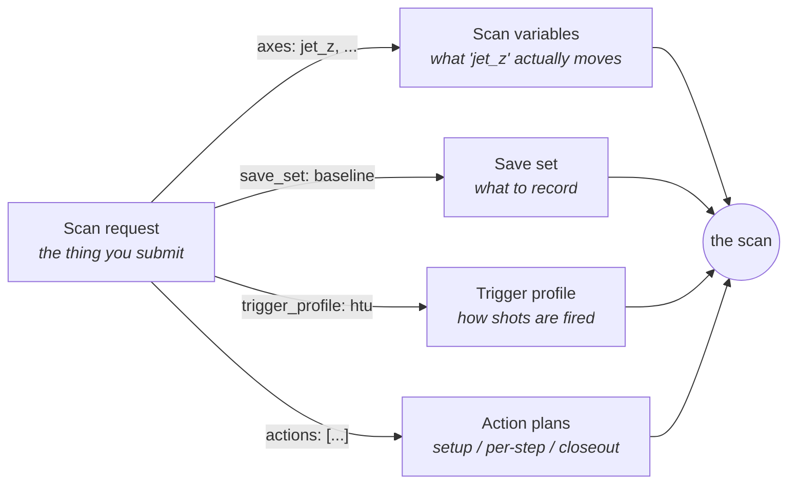

# Scanner Configs, Explained

Everything the scanner does is driven by five kinds of config file. Each one
answers a single question, and a scan is just those answers put together.
This page is the plain-language map; the per-field reference is generated
straight from the code, so it can never drift from what the scanner actually
accepts.

## The five config kinds

**Scan request — "what scan am I running?"**
The one document you actually submit. It says whether you're sweeping a
variable (`step`), standing still collecting shots (`noscan`), or letting an
optimizer drive (`optimize`); which positions to visit and how many shots to
take at each; and — by name — which save set, trigger profile, and action
plans to use. A step scan can sweep one axis or several — several axes form
a grid, with the first axis as the slowest loop and the last as the fastest.
A saved preset *is* a scan request.

**Save set — "what data gets recorded?"**
The shopping list of devices to save: for each device, which scalar readings
become columns in the scan data, and whether its images are saved. You don't
declare timestamps or synchronization flags any more — the scanner works
those out. The device database's own scan defaults still apply — its
scan-start/end writes and, if you opt in, its standard telemetry list — and
an entry can override any of those writes per variable: replace the value,
or suppress the write entirely with `null`.

**Scan variables — "what am I allowed to sweep?"**
The catalog behind the Variable dropdown. Each entry gives a friendly name
("JetZ (mm)") to a device knob, or defines a *pseudo* variable that moves
several devices together from one number (a jet position that also tracks a
probe stage, for example).

**Trigger profile — "how are shots fired?"**
The machine's trigger states — OFF, STANDBY, SCAN, SINGLESHOT, ARMED — and,
for each one, the exact device writes that put the machine there, in the
order they are sent. A transition can touch several devices (the delay
generator, a gas-jet controller, a shutter), not just one. Alternative
conditions that used to be copy-pasted files — laser on vs laser off — are
now *variants* inside one profile, so the difference is explicit and
reviewable.

**Action plans — "what happens automatically around the scan?"**
Named checklists of steps — set a variable, wait, check a readback, run
another plan. A scan request points at them in three slots: `setup` (before
the scan), `per_step` (between positions), and `closeout` (after, even on
abort).

## How they fit together when a scan runs

When you press Start, the scan request is the only thing submitted. The
scanner looks up the names it contains: the scan variable tells it what to
move, the save set tells it what to record, the trigger profile tells it how
to gate shots, and the action plans run at their slots. Change what a name
*means* (say, add a camera to the save set) and every preset using that name
picks up the change; change the *request* and nothing else is touched.

## Two habits worth knowing

- **Typos fail loudly.** Config files are checked when loaded — a misspelled
  field name is an immediate error message naming the bad key, not a setting
  that silently does nothing.
- **You describe intent, not mechanics.** If you remember declaring
  `synchronous:` flags, `acq_timestamp` bookkeeping variables, or parallel
  laser-off files: those are gone on purpose. The scanner derives them, and
  the old files convert automatically.

*(The detailed per-field reference — every field, its type, default, and
what it does — is generated from these same schemas; see the GEECS-Schemas
package README for how to render it.)*
