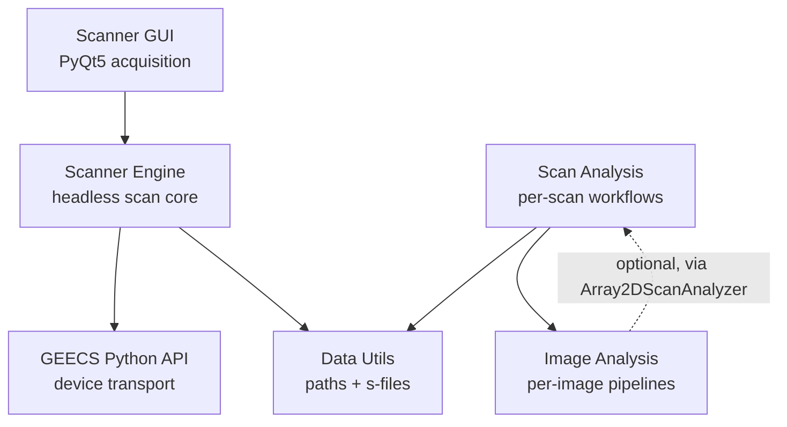

# GEECS Plugin Suite

A collection of Python tools for laser-plasma experiments at [Lawrence Berkeley National Laboratory's BELLA Center](https://bella.lbl.gov/). The facility uses **GEECS** (Generalized Equipment and Experiment Control System) for hardware control and data acquisition; this suite extends that ecosystem with a Python-native interface for scanning, image analysis, and post-processing.

## Start where you are

| If you want to... | Go here |
|---|---|
| **Run a scan from a GUI** | [Scanner Tutorial](geecs_scanner/tutorial.md) — your first NOSCAN and 1D scan, end to end |
| **Add a device to a scan** | [Save Elements](geecs_scanner/save_elements.md) — the YAML format for what to record |
| **Find your data on disk** | [Scan Output Structure](geecs_scanner/scan_output_structure.md) — what's in `Scan###/` and how to load each file |
| **Diagnose why a scan failed** | [Troubleshooting](geecs_scanner/troubleshooting.md) — common errors and what they mean |
| **Analyze images from a camera** | [Image Analysis — Basic Offline Analysis](image_analysis/examples/basic_offline_analysis.ipynb) |
| **Find the right analyzer for your diagnostic** | [Analyzer Index](image_analysis/analyzer_index.md) — beam profile, FROG, magspec, ICT, HASO |
| **Run analysis across a scan** | [Scan Analysis — Basic Usage](scan_analysis/examples/basic_usage.ipynb) |
| **Set up automated post-scan analysis** | [Scan Analysis — Config-Based Workflow](scan_analysis/examples/config_based_scan_analysis.ipynb) |
| **Watch and process scans live** | [Scan Analysis — Live Watch](scan_analysis/examples/live_watch.ipynb) |
| **Upload results to a Google Doc e-log** | [Scan Analysis — GDoc Upload](scan_analysis/examples/gdoc_upload.ipynb) |
| **Run a parameter optimization scan** | [Scanner — Optimization Example](geecs_scanner/examples/optimization/optimization_example.ipynb) |
| **Write a script that talks to a GEECS device** | [GEECS Python API — Scripting Guide](geecs_python_api/scripting_guide.md) |
| **Write a custom evaluator or analyzer** | [Extending the Scanner](geecs_scanner/extending.md) |
| **Understand the engine internals** | [Architecture](geecs_scanner/architecture.md) |

## What's in this suite

**[GEECS Scanner GUI](geecs_scanner/overview.md)** — a PyQt5 data-acquisition application that runs scans, manages save elements, and supports multi-scan batches and Xopt-driven optimization. The primary tool for collecting data; the engine underneath is also usable as a headless library.

**[Image Analysis](image_analysis/overview.md)** — image processing and analysis for camera data. YAML-configured pipelines (background, masking, filtering, transforms, thresholding) with specialized analyzers for beam profile, FROG, magspec, HASO wavefront, and 1D traces. Used both offline and inside scan analyzers.

**[Scan Analysis](scan_analysis/overview.md)** — orchestrates analysis across a complete scan: shot binning, per-bin processing, summary figure rendering, s-file appending. Runs interactively on a finished scan or as a `LiveTaskRunner` that processes scans automatically as they complete. Optional integration with Google Doc e-logs.

**[GEECS Python API](geecs_python_api/overview.md)** — the low-level interface to GEECS hardware: device communication, the experiment database, and the UDP/TCP transport. Most tools use this indirectly; the [Scripting Guide](geecs_python_api/scripting_guide.md) covers the case where you want to use it directly.

**[GEECS Data Utils](geecs_data_utils/overview.md)** — path resolution and data loading for GEECS scan folders. Resolves `(experiment, date, scan_number)` to a folder path on disk, loads s-files, and provides the common types used across the suite. Typically a dependency rather than a direct import.

## How the packages fit together

A typical workflow: the Scanner GUI runs a scan that writes a folder to the data server. ScanAnalysis (live or offline) reads that folder, runs configured ImageAnalysis analyzers across the shots, renders summary figures, and appends derived scalars back to the s-file. A separate notebook can then load the s-file via Data Utils for ad-hoc exploration.

## Common entry points by role

If you're a **lab user running scans**, start with the [Scanner Installation](geecs_scanner/installation.md) and [Tutorial](geecs_scanner/tutorial.md).

If you're a **student or scientist analyzing data**, the [Image Analysis Basic Usage](image_analysis/examples/basic_offline_analysis.ipynb) and [Scan Analysis Basic Usage](scan_analysis/examples/basic_usage.ipynb) notebooks are the right starting points; the [Analyzer Index](image_analysis/analyzer_index.md) helps you find the right tool for a specific diagnostic.

If you're **scripting your own measurements**, start with the [Python API Scripting Guide](geecs_python_api/scripting_guide.md).

If you're **maintaining or extending the codebase**, read the [Scanner Architecture](geecs_scanner/architecture.md) page first — it documents the engine's lifecycle, event flow, and design rationale.

---

*GEECS — Copyright (c) 2016, The Regents of the University of California, through Lawrence Berkeley National Laboratory*
