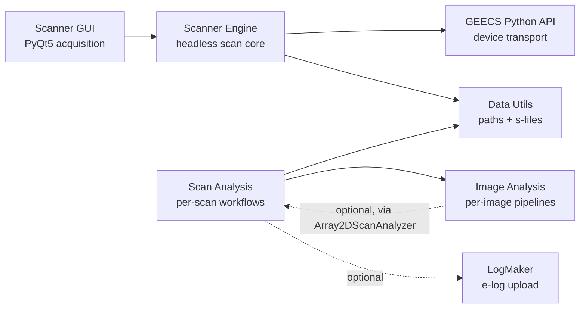

# GEECS Plugin Suite

**A Python-native toolkit for the BELLA beamline at LBNL.**

The GEECS Plugin Suite extends LBNL's
[GEECS](https://bella.lbl.gov/) (Generalized Equipment and Experiment Control
System) acquisition platform with Python-native tools for scanning, image
analysis, scan post-processing, and automated e-log uploads. Each subdirectory
is an independent Python package; together they cover the experimental data
lifecycle from acquisition through analysis to delivery.

## Where to start

The suite splits cleanly into the two halves of the experimental data
lifecycle — **acquisition** and **analysis**. The first two cards below
follow that split; the bottom row is for navigation and troubleshooting.

-   :material-camera-iris:{ .lg .middle } **Data Acquisition**

    ---

    Run scans on the beamline. Configure save elements, drive multi-scan
    batches, and run Xopt-driven optimization through the Scanner GUI —
    or use its engine headlessly from your own scripts.

    [:octicons-arrow-right-24: Scanner GUI tutorial](geecs_scanner/tutorial.md) ·
    [Overview](geecs_scanner/overview.md)

-   :material-chart-areaspline:{ .lg .middle } **Data Analysis**

    ---

    Process per-shot images, configure analysis pipelines, run automated
    per-scan analysis via LiveWatch. Edit configs in ConfigFileGUI; run
    them headlessly or interactively via the Image/Scan Analysis APIs.

    [:octicons-arrow-right-24: Analysis apps](apps/index.md) ·
    [Tutorial](apps/tutorial.md)

-   :material-cube-outline:{ .lg .middle } **Browse by package**

    ---

    Overviews, examples, and API reference for each package in the
    suite. Pick this if you already know which piece you're working
    with.

    [:octicons-arrow-right-24: Scanner GUI](geecs_scanner/overview.md) ·
    [Image Analysis](image_analysis/overview.md) ·
    [Scan Analysis](scan_analysis/overview.md) ·
    [Data Utils](geecs_data_utils/overview.md) ·
    [Python API](geecs_python_api/overview.md)

-   :material-bug-outline:{ .lg .middle } **Troubleshooting & internals**

    ---

    Common scan failure modes, the `/triage` skill for diagnosing
    recurring issues, and the architecture deep-dives.

    [:octicons-arrow-right-24: Troubleshooting](geecs_scanner/troubleshooting.md) ·
    [Skills](skills/overview.md) ·
    [Architecture](geecs_scanner/architecture.md)

## How the packages fit together

A typical workflow: the Scanner GUI runs a scan that writes a folder to the
data server. Scan Analysis (live or offline) reads that folder, runs
configured Image Analysis analyzers across the shots, renders summary
figures, and appends derived scalars back to the s-file. A separate notebook
can then load the s-file via Data Utils for ad-hoc exploration.

## Packages at a glance

**[GEECS Scanner GUI](geecs_scanner/overview.md)** — PyQt5 data-acquisition
application that runs scans, manages save elements, and supports multi-scan
batches and Xopt-driven optimization. Primary tool for collecting data; the
engine underneath is also usable as a headless library.

**[Image Analysis](image_analysis/overview.md)** — per-image processing and
analysis. Pipelines are described in YAML (background, masking, filtering,
geometric transforms, thresholding) with specialised analyzers for beam
profile, FROG, magspec, HASO wavefront, and 1D traces.

**[Scan Analysis](scan_analysis/overview.md)** — orchestrates analysis across
a complete scan: shot binning, per-bin processing, summary figure rendering,
s-file appending. Runs interactively or as a `LiveTaskRunner` that processes
scans automatically as they complete. Optional integration with Google Doc
e-logs via `LogMaker4GoogleDocs`.

**[GEECS Python API](geecs_python_api/overview.md)** — low-level interface to
GEECS hardware: device communication, the experiment database, and the shared
[`config.ini`](geecs_python_api/scripting_guide.md). Most tools use it
indirectly; the [Scripting Guide](geecs_python_api/scripting_guide.md) covers
direct use.

**[GEECS Data Utils](geecs_data_utils/overview.md)** — path resolution and
data loading for scan folders. Resolves `(experiment, date, scan_number)` to
an on-disk path, loads s-files, and defines the common types used across the
suite. Typically a dependency rather than a direct import.

## How the docs are organised

Within each package, content is split into four kinds — different modes for
different questions:

- **Tutorials** teach by guided walkthrough — start here if you're new.
- **How-To guides** are task recipes — "add a save element," "diagnose a
  failed scan," "configure background subtraction."
- **Reference** is for lookup once you know what you want — API docs,
  config schema, CLI flags.
- **Explanation** covers the *why* behind the *how* — architecture,
  design rationale, what each package is for.

If you're looking for something specific and you already know roughly where
it lives, the left-hand navigation will get you there fastest. If you're new,
the [Tutorial](apps/tutorial.md) is the right entry point.

---

*GEECS — Copyright © 2016, The Regents of the University of California,
through Lawrence Berkeley National Laboratory.*
