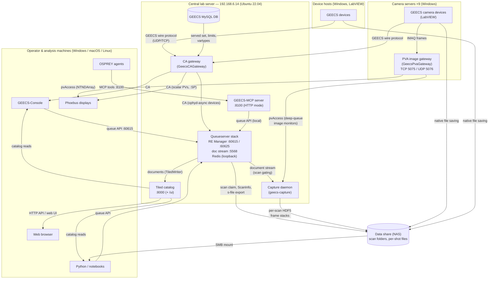

# Fleet Map

What runs where, and how the pieces talk to each other. This is the
operations-level picture of the GEECS-Plugins service fleet: when
something is down, start here to find the host, the port, the health
check, and the runbook.

Each service's authoritative deployment guide lives next to its code in
the repository (linked in the table below) — this page is the map, not
the manual.

!!! note "Snapshot"
    Reflects the deployed fleet as of **August 2026**. When a service
    moves or a new one lands, update this page in the same PR.

## The picture

Planned additions (not yet deployed): the **GEECS Data Portal** — a
read-only scan-browsing web app joining Tiled and the data share — and a
consolidated services server that will absorb the central-server roles
above (the queueserver worker and capture daemon move together — their
co-location is a requirement, not a convenience).

## The services

| Service | Host | Port(s) | Supervision | Health check | Runbook |
|---|---|---|---|---|---|
| CA gateway (GeecsCAGateway) | 192.168.6.14 | CA 5064/5065 | systemd `geecs-ca-gateway` | heartbeat + per-device `CONNECTED` PVs; `systemctl status` | [GeecsCAGateway/DEPLOYMENT.md](https://github.com/GEECS-BELLA/GEECS-Plugins/blob/master/GeecsCAGateway/DEPLOYMENT.md) |
| Tiled catalog | 192.168.6.14 | HTTP 8000 | systemd `tiled` | `GET /api/v1/`; web UI at `/ui` | [GeecsBluesky/TILED_SETUP.md](https://github.com/GEECS-BELLA/GEECS-Plugins/blob/master/GeecsBluesky/TILED_SETUP.md) |
| Queueserver worker (RE Manager + Redis + doc proxy) | 192.168.6.14 (interim; runbook targets a dedicated host) | ZMQ 60615 (control), 60625 (console stream), 5568 (documents); Redis loopback-only | systemd `geecs-qserver` | `qserver status` from any client env | [GeecsBluesky/qserver/deploy/DEPLOYMENT.md](https://github.com/GEECS-BELLA/GEECS-Plugins/blob/master/GeecsBluesky/qserver/deploy/DEPLOYMENT.md) |
| GEECS-MCP server | 192.168.6.14 (co-located with the worker by design) | HTTP 8100 (`/mcp`); also runs as stdio per-machine | systemd (HTTP mode) | tool call `scan_status` from an agent | [GEECS-MCP/deploy/DEPLOYMENT.md](https://github.com/GEECS-BELLA/GEECS-Plugins/blob/master/GEECS-MCP/deploy/DEPLOYMENT.md) |
| Capture daemon (`geecs_bluesky.capture`) | the queueserver worker host (co-location is a **requirement**: shared filesystem view + local heartbeat) | consumes doc stream (5568) + pvAccess; no listening port | systemd `geecs-capture` | heartbeat file refreshing every ~10 s (`~/.local/state/geecs-capture/heartbeat.json` in the service user's home); discovery line in `journalctl -u geecs-capture` | [GeecsBluesky/capture/deploy/DEPLOYMENT.md](https://github.com/GEECS-BELLA/GEECS-Plugins/blob/master/GeecsBluesky/capture/deploy/DEPLOYMENT.md) |
| PVA image gateways (GeecsPvaGateway) | each camera server (9 hosts) | pvAccess TCP 5075 / UDP 5076 | NSSM service `GeecsPvaGateway` (auto-start, pull-on-restart) | fleet status Phoebus screen (`deploy/fleet_status.bob`) | [GeecsPvaGateway/DEPLOYMENT.md](https://github.com/GEECS-BELLA/GEECS-Plugins/blob/master/GeecsPvaGateway/DEPLOYMENT.md) |
| GEECS MySQL DB | 192.168.6.14 | 3306 | LabVIEW/GEECS infrastructure (not managed by this repo) | any `GeecsDb` client connect | — |
| Data share (NAS) | NAS appliance | SMB | storage infrastructure (not managed by this repo) | mount visible, scan folders resolvable | — |
| GEECS LabVIEW devices | Windows device hosts | GEECS wire protocol (UDP/TCP) | Master Control / device GUIs | device `CONNECTED` PV via the gateway | — |

## How the planes connect

The fleet is easiest to reason about as four planes, each with one
transport:

**Control plane — Channel Access.** The CA gateway is the single scalar
access layer: it subscribes to every enabled GEECS device over the GEECS
wire protocol and serves readbacks plus `:SP` setpoints as CA PVs.
Everything that reads or writes a device value — Phoebus, the console,
the Bluesky worker's ophyd-async devices — goes through it. The GEECS
MySQL DB feeds it the served set (devices, variables, limits, types).

**Image plane — pvAccess.** Live camera frames deliberately bypass the
central server: each camera server runs its own PVA gateway serving that
host's cameras as NTNDArray PVs (gated subscriptions, latest-wins).
Viewers connect point-to-point; 2 MB frames never transit the control
plane.

**Orchestration plane — the queue.** Scans exist as `ScanRequest`s
submitted to the RE Manager's queue (ZMQ, port 60615). The console,
notebooks, and the MCP server are all peer clients of the same queue
API; the worker executes plans against the CA gateway's PVs and streams
progress on the document (5568) and console-output (60625) ports.

**Data plane — the share plus the catalog.** During a scan, devices
save per-shot files natively to the data share while the worker writes
scan folders, `ScanInfo`, and the exported s-file; every event document
also lands in the Tiled catalog, which is the queryable index over what
was taken. The capture daemon adds a second image path: it consumes the
worker's document stream (to know when a scan is running and which
cameras are in it) and the PVA gateways' image PVs, and writes one
HDF5 frame stack per camera per scan into the scan folder, alongside
the native files (dual-write; the `native_image_save` toggle governs
whether eligible cameras also write native files, while
proprietary-format devices — HASO, scopes — always keep native saving).
Analysis reads any of these surfaces: files via the mounted share,
frame stacks via `geecs_data_utils` `scan_stack`, scalars and metadata
via Tiled.

## Client configuration in one place

Every client machine points at the fleet through the same file,
`~/.config/geecs_python_api/config.ini` — the CA gateway address
(`[epics] ca_addr_list`), the Tiled URI and API key (`[tiled]`), the
data-share path (`[Paths] geecs_data`), and the queueserver address
(`[qserver]`). See the
[Getting started](../tutorials/getting_started.md) tutorial for the
canonical reference.
