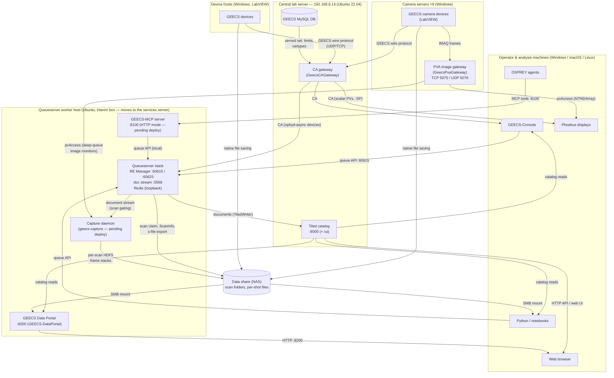

# Fleet Map

What runs where, and how the pieces talk to each other. This is the
operations-level picture of the GEECS-Plugins service fleet: when
something is down, start here to find the host, the port, the health
check, and the runbook.

Each service's authoritative deployment guide lives next to its code in
the repository (linked in the table below) — this page is the map, not
the manual.

!!! note "Snapshot"
    Reflects the fleet as of **September 2026**. Deployed and running:
    the CA gateway, the GEECS DB, Tiled, the PVA image gateways, the
    queueserver worker (on an interim host), and the GEECS Data Portal
    (0.15.x — analysis tabs, per-bin image grid, ephemeral processing).
    Documented here ahead of
    deployment: the GEECS-MCP HTTP service and the capture daemon
    (which lands with the central-PVA-capture arc). When a service
    moves, deploys, or a new one lands, update this page in the same
    PR.

## The picture

Arrows follow the **primary flow of data or commands** over each link
(readings toward their readers, submissions toward the queue); `:SP`
setpoint writes travel against the readback arrows, over the same
connections.

Planned additions (not yet deployed): a
consolidated services server that will absorb the central-server roles
above (the queueserver worker and capture daemon move together — their
co-location is a requirement, not a convenience).

## The services

The **Checkout** column names the git clone a service runs from, as a
path in the service account's home on its host — see
[one clone per service](#one-clone-per-service) below for why each
service gets its own.

| Service | Host | Checkout | Port(s) | Supervision | Health check | Runbook |
|---|---|---|---|---|---|---|
| CA gateway (GeecsCAGateway) | 192.168.6.14 | `~/GEECS-Plugins` | CA 5064/5065 | systemd `geecs-ca-gateway` | heartbeat + per-device `CONNECTED` PVs; `systemctl status` | [GeecsCAGateway/DEPLOYMENT.md](https://github.com/GEECS-BELLA/GEECS-Plugins/blob/master/GeecsCAGateway/DEPLOYMENT.md) |
| Tiled catalog | 192.168.6.14 | — (pip install + `~/tiled/config.yml`) | HTTP 8000 | systemd `tiled` | `GET /api/v1/`; web UI at `/ui` | [GeecsBluesky/TILED_SETUP.md](https://github.com/GEECS-BELLA/GEECS-Plugins/blob/master/GeecsBluesky/TILED_SETUP.md) |
| Queueserver worker (RE Manager + Redis + doc proxy) | the worker host (interim box; the runbook targets a dedicated host) | `~/qs-checkout` | ZMQ 60615 (control), 60625 (console stream), 5568 (documents); Redis loopback-only | systemd `geecs-qserver` | `qserver status` from any client env | [GeecsBluesky/qserver/deploy/DEPLOYMENT.md](https://github.com/GEECS-BELLA/GEECS-Plugins/blob/master/GeecsBluesky/qserver/deploy/DEPLOYMENT.md) |
| GEECS-MCP server — *HTTP mode pending deploy* | the worker host (co-located by design; stdio mode runs per-machine today) | own clone when deployed (per the pattern below) | HTTP 8100 (`/mcp`) | systemd (HTTP mode) | tool call `scan_status` from an agent | [GEECS-MCP/deploy/DEPLOYMENT.md](https://github.com/GEECS-BELLA/GEECS-Plugins/blob/master/GEECS-MCP/deploy/DEPLOYMENT.md) |
| Capture daemon (`geecs_bluesky.capture`) — *pending deploy* | the queueserver worker host (co-location is a **requirement**: shared filesystem view + local heartbeat) | `~/qs-checkout` (shares the worker's clone — the co-location requirement extends to code state) | consumes doc stream (5568) + pvAccess; no listening port | systemd `geecs-capture` | heartbeat file refreshing every ~10 s (`~/.local/state/geecs-capture/heartbeat.json` in the service user's home); discovery line in `journalctl -u geecs-capture` | [GeecsBluesky/capture/deploy/DEPLOYMENT.md](https://github.com/GEECS-BELLA/GEECS-Plugins/blob/master/GeecsBluesky/capture/deploy/DEPLOYMENT.md) |
| GEECS Data Portal (GEECS-DataPortal) | the worker host (interim box; moves with the services-server consolidation) | `~/portal-checkout` | HTTP 8200 | systemd `geecs-data-portal` | `GET /health` (catalog probe); any day page in a browser | [GEECS-DataPortal/DEPLOYMENT.md](https://github.com/GEECS-BELLA/GEECS-Plugins/blob/master/GEECS-DataPortal/DEPLOYMENT.md) |
| PVA image gateways (GeecsPvaGateway) | each camera server (9 hosts) | per-host clone (NSSM pulls on restart) | pvAccess TCP 5075 / UDP 5076 | NSSM service `GeecsPvaGateway` (auto-start, pull-on-restart) | fleet status Phoebus screen (`deploy/fleet_status.bob`) | [GeecsPvaGateway/DEPLOYMENT.md](https://github.com/GEECS-BELLA/GEECS-Plugins/blob/master/GeecsPvaGateway/DEPLOYMENT.md) |
| GEECS MySQL DB | 192.168.6.14 | — | 3306 | LabVIEW/GEECS infrastructure (not managed by this repo) | any `GeecsDb` client connect | — |
| Data share (NAS) | NAS appliance | — | SMB | storage infrastructure (not managed by this repo) | mount visible, scan folders resolvable | — |
| GEECS LabVIEW devices | Windows device hosts | — | GEECS wire protocol (UDP/TCP) | Master Control / device GUIs | device `CONNECTED` PV via the gateway | — |

## One clone per service

When several services from this monorepo share a host, **each service
family runs from its own clone** of GEECS-Plugins (and installs its own
Poetry env inside it). This is deliberate, not accumulation:

- **A pull for one service must never change the code under another
  running service.** Units run with `Restart=on-failure`: with a shared
  working tree, deploying service A would leave service B one crash
  away from auto-restarting onto code nobody validated for B.
- **Deploy cadence differs per service.** The portal iterates in days;
  the CA gateway is control-room-critical and moves rarely; the worker
  moves only at hardware-verified milestones. Each clone sits pinned at
  its service's last *verified* deploy — a per-service rollback point,
  not drift.
- The queueserver worker and capture daemon are the one deliberate
  exception: they share `~/qs-checkout` because their co-location (and
  co-versioning) is a requirement of the capture design.

A clone is deployed by `git pull` (or checkout of a pinned ref) +
`poetry install` **with the extras that service needs** (each runbook
names them; e.g. the portal's optional processing selector needs
`--extras analysis`) + `systemctl restart <unit>`. Never `git pull` a
clone that isn't the one your service runs from.

### Fresh-host bootstrap (collected from live deploys)

The services-server consolidation will redo these steps; gotchas that
cost real time, so they aren't re-learned:

1. Create the dedicated service account; install everything as that
   account (units run as it). Python 3.11 and `~/.local/bin/poetry`
   per the runbooks.
2. One clone per service family, named for the service
   (`~/<service>-checkout`); per-clone `poetry install` **inside the
   package directory**, with that service's extras.
3. `~/.config/geecs_python_api/config.ini` per the
   [Getting started](../tutorials/getting_started.md) reference — it
   feeds every service (CA address, Tiled URI/key, data-share path,
   qserver address, config-repo paths).
4. Non-login shells (plain `ssh host 'cmd'`, systemd) don't have
   `~/.local/bin` on `PATH` — use `bash -lc` for remote poetry
   commands, and absolute `ExecStart` paths in units.
5. A GEECS-Plugins-Configs checkout consumed from the data share is
   typically Windows-authored (CRLF): set `core.autocrlf true` on that
   checkout before pulling from Linux, or every file reads as locally
   modified and pulls abort. Never "fix" the line endings in place —
   LabVIEW consumers read the same files.
6. Quote systemd `ExecStart` arguments that carry share paths — the
   lab's paths contain spaces (`.../Active Version/...`).
7. Install units from each package's `deploy/` template (generic
   service-account placeholders), then `systemctl daemon-reload`,
   `enable`, `start`, and run the runbook's health check before
   calling it deployed. Update this page's table in the same PR.

## How the planes connect

The fleet is easiest to reason about as four planes, each with one
transport:

**Control plane — Channel Access.** The CA gateway is the single scalar
access layer: it subscribes to every enabled GEECS device over the GEECS
wire protocol and serves readbacks plus `:SP` setpoints as CA PVs.
Everything that reads or writes a device value — Phoebus, the console,
the Bluesky worker's ophyd-async devices — goes through it. The GEECS
MySQL DB feeds it the served set (devices, variables, limits, types).

**Image plane — pvAccess.** Live camera frames deliberately bypass the
central server: each camera server runs its own PVA gateway serving that
host's cameras as NTNDArray PVs (gated subscriptions, latest-wins).
Viewers connect point-to-point; 2 MB frames never transit the control
plane.

**Orchestration plane — the queue.** Scans exist as `ScanRequest`s
submitted to the RE Manager's queue (ZMQ, port 60615). The console,
notebooks, and the MCP server are all peer clients of the same queue
API; the worker executes plans against the CA gateway's PVs and streams
progress on the document (5568) and console-output (60625) ports.

**Data plane — the share plus the catalog.** During a scan, devices
save per-shot files natively to the data share while the worker writes
scan folders, `ScanInfo`, and the exported s-file; every event document
also lands in the Tiled catalog, which is the queryable index over what
was taken. The capture daemon adds a second image path: it consumes the
worker's document stream (to know when a scan is running and which
cameras are in it) and the PVA gateways' image PVs, and writes one
HDF5 frame stack per camera per scan into the scan folder, alongside
the native files (dual-write; the `native_image_save` toggle governs
whether eligible cameras also write native files, while
proprietary-format devices — HASO, scopes — always keep native saving).
Analysis reads any of these surfaces: files via the mounted share,
frame stacks via `geecs_data_utils` `scan_stack`, scalars and metadata
via Tiled. The Data Portal is the zero-install reader over the same
surfaces — runs and scalars from the catalog, per-shot files from the
share — for anyone with a browser.

## Client configuration in one place

Every client machine points at the fleet through the same file,
`~/.config/geecs_python_api/config.ini` — the CA gateway address
(`[epics] ca_addr_list`), the Tiled URI and API key (`[tiled]`), the
data-share path (`[Paths] geecs_data`), and the queueserver address
(`[qserver]`). See the
[Getting started](../tutorials/getting_started.md) tutorial for the
canonical reference.
